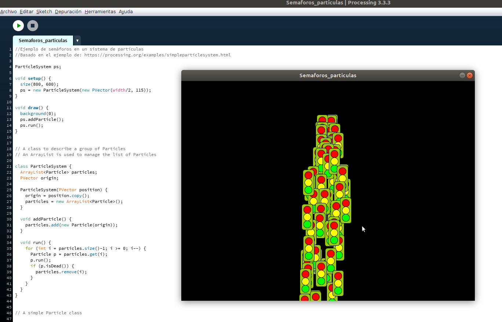
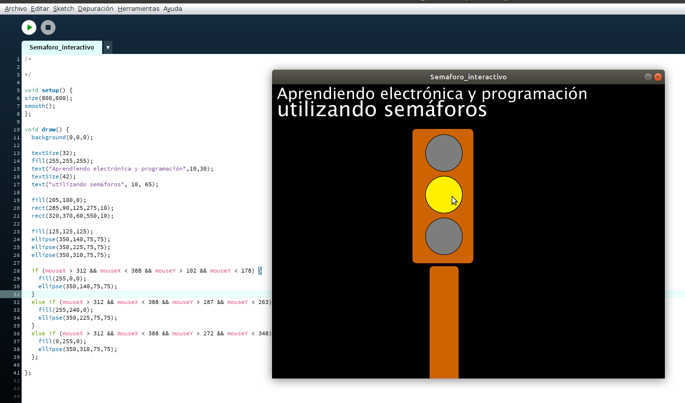

# Processing

Dos ejemplos de programación mediante Processing:

- Sistema de partículas. Veremos múltiples semáforos cayendo en cascada.

- Semáforo interactivo. Se ilumina la luz de cada color cuando pasamos el ratón por encima.

## Sobre el autor

Me llamo Jorge, aunque algunos me conocen como @akirasan. Desde que en 2011 conocí Arduino no he querido parar de aprender, y para aprender utilizo una técnica muy sencilla: construir cosas. Manteniendo la curiosidad por saber cómo funcionan las cosas. Y Arduino me abrió una puerta a la electrónica digital. Un mundo que desconocía casi por completo, ya que siempre he estado mas enfocado al software abierto, pero no al hardware abierto.

A nivel personal soy miembro (me tienen puesto de presidente) de una comunidad de Makers llamada Ripola Hacklab, dónde hacemos divulgación de la tecnología a la Comunidad Educativa. Buscamos hacer cosas chulas para que las familias construyan y aprendan juntas.

## Porqué esta plataforma

Processing es un entorno de programación creado para artístas visuales. Ideal para comenzar... 

## Cómo y porqué de tu proyecto

El "cómo y porqué" del proyecto es claro: Nos calentamos muy rápido por Twitter.
Soy muy fan del hashtag [#NoMásSemáforos][3]. Creo que se pueden aprender y hacer muchas cosas chulas, mas allá de los semáforos (que viene a ser el tipico ejemplo recurrente y poco atractivo).

[1]: https://www.akirasan.net
[2]: https://github.com/akirasan
[3]: https://twitter.com/hashtag/nomassemaforos
