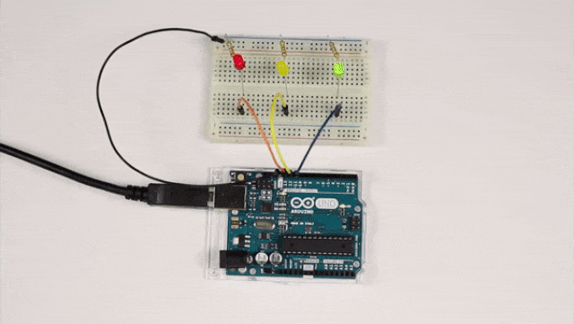
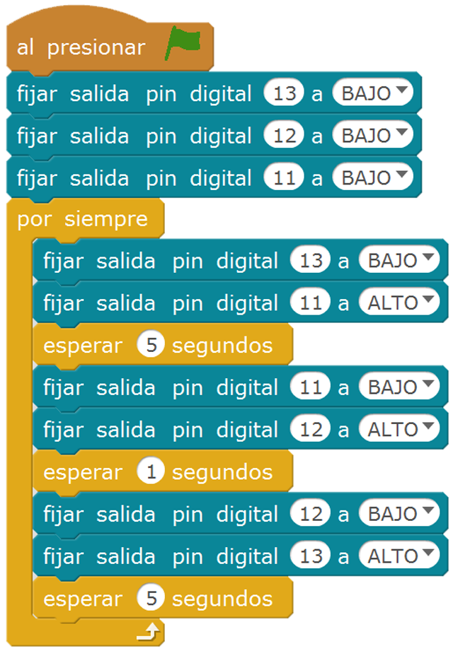

# mBlock

Este es el ejemplo de cómo programar un semáforo sencillo mediante el lenguaje de programación por bloques de mBlock usando una placa Arduino UNO oficial.

## Sobre el autor

Programador por profesión, mentor de programación por vocación. Cofundador Iniciativa [Programo Ergo Sum][1] y [Aprende Programando][2], Presidente [CoderDojo España][3], elaborador del material del programa educativo de la Región de Murcia [El Cable Amarillo][4], #maker y más cosillas. 

 [Miguel Ángel Abellán][5]

## Porqué esta plataforma

mBlock es un entorno gráfico de programación basado en Scratch 2.0 para que principiantes en la programaicón y robótica puedan programar robots con Arduino de una forma muy sencilla.

## Cómo y porqué de tu proyecto

Aunque apoyo el hashtag [#NoMásSemáforos][6], como docente creo que un alumno debe pasar por esta práctica en sus inicios, **insisto**, **en sus inicios** solamente.

[1]: https://www.programoergosum.com
[2]: https://www.aprendeprogramando.es
[3]: http://www.coderdojo.es
[4]: https://programoergosum.gitbooks.io/practicas-educativas-con-arduino/content/
[5]: https://github.com/migueabellan
[6]: https://twitter.com/hashtag/nomassemaforos